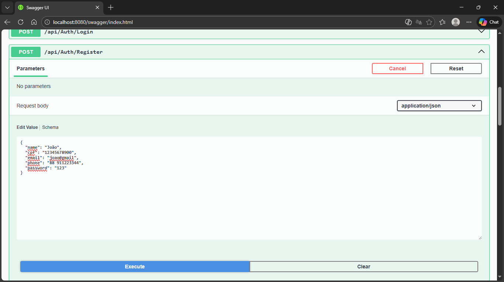
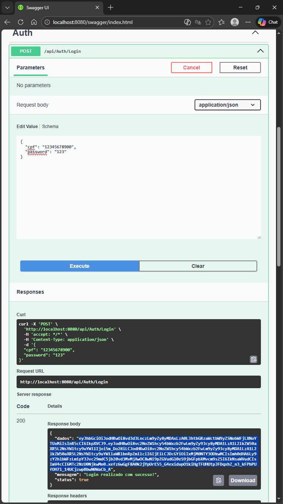
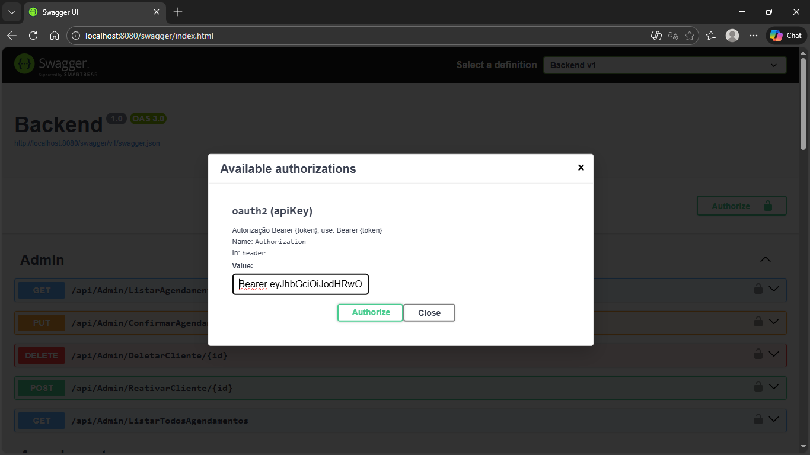

   | docker run -e "ACCEPT_EULA=Y" -e "SA_PASSWORD=1234" -p 1433:1433 --name sqlserver2022 -d mcr.microsoft.com/mssql/server:2022-latest 

# 🚛 DiskEntulho - Sistema de Gerenciamento de Caçambas

Sistema completo para locação e gerenciamento de caçambas de entulho, com painel administrativo e integração de pagamentos.


## 🚀 Tecnologias Utilizadas

- **Backend:** .NET 8 (C#), Entity Framework Core
- **Frontend:** React (Next.js), Tailwind CSS
- **Banco de Dados:** SQL Server (via Docker)
- **Infraestrutura:** Docker & Docker Compose
- **Pagamentos:** Integração com PagBank (PIX e Cartão)

## ⚙️ Pré-requisitos

- Docker e Docker Compose instalados.
- Git instalado.

## 🛠️ Como Rodar o Projeto

O projeto está totalmente containerizado. Para rodar, basta executar:

1. Clone o repositório:
   ```bash
   git clone [https://github.com/seu-usuario/DiskEntulho_PI4.git](https://github.com/seu-usuario/DiskEntulho_PI4.git)
   cd DiskEntulho_PI4

## 🔐 Autenticação e Segurança

A segurança do sistema é gerenciada via **JWT (JSON Web Token)**. O controle de acesso é baseado em *Roles* (perfis), garantindo que apenas usuários autorizados acessem endpoints sensíveis.

### 👤 Perfis de Acesso (Roles)

- **Cliente:** Pode agendar caçambas, visualizar seu próprio histórico e realizar pagamentos (PIX/Cartão).
- **Admin:** Possui privilégios elevados para:
  - Aprovar pagamentos em espécie.
  - Gerenciar cadastro de caçambas e preços.
  - Visualizar todos os agendamentos do sistema.

### ⚙ Como Funciona

1. **Login:** O usuário envia o CPF e Senha para o endpoint de autenticação.
2. **Token:** O backend valida e retorna um token JWT (Bearer Token).
3. **Requisições:** O Frontend armazena esse token e o envia no cabeçalho `Authorization` de cada requisição HTTP subsequente.

### 🛣 Acessando Rotas Protegidas (Swagger)

Para testar endpoints com cadeado 🔒 no Swagger:
1. Faça registro na rota `/api/Auth/Register`.

2. Depois faça login na rota `/api/Auth/Login` e copie o `token` gerado.

3. Clique no botão verde **Authorize** no topo da página.
4. Insira o valor no formato: `Bearer SEU_TOKEN_COPIADO`.

5. Clique em **Authorize**. Agora você tem acesso às rotas de Cliente.