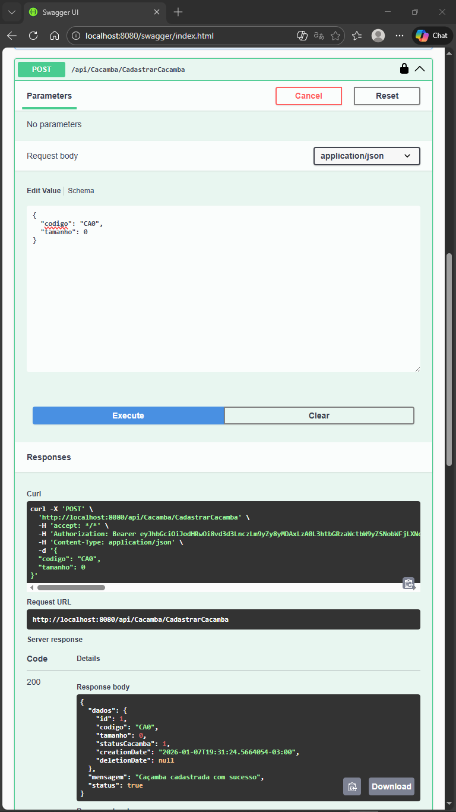
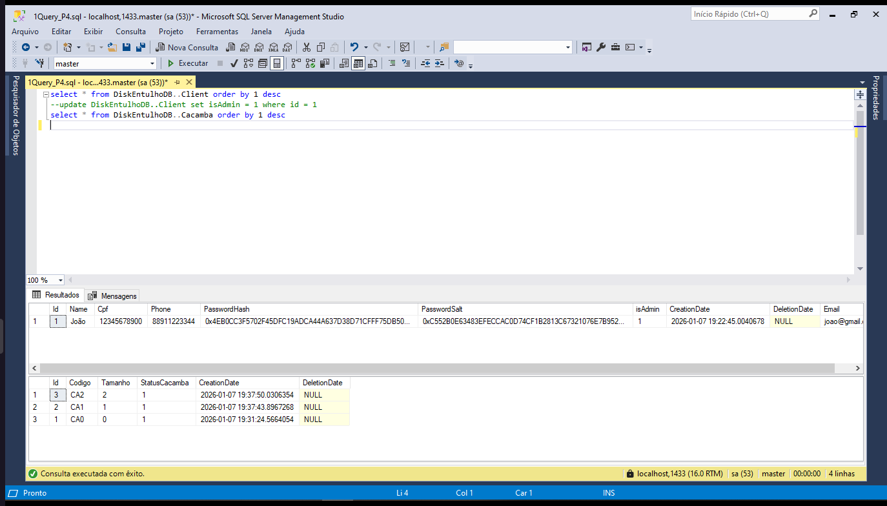
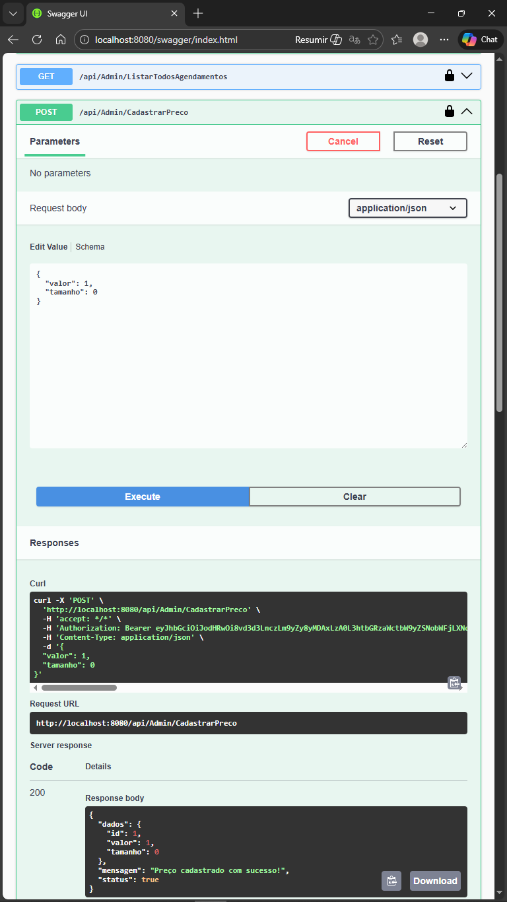
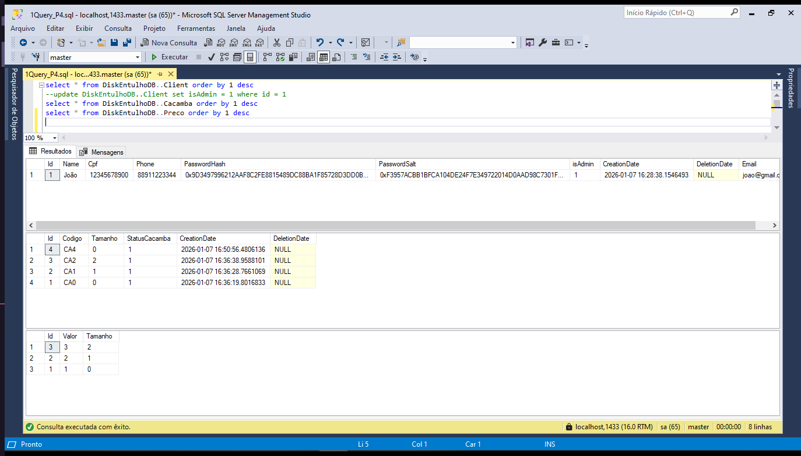
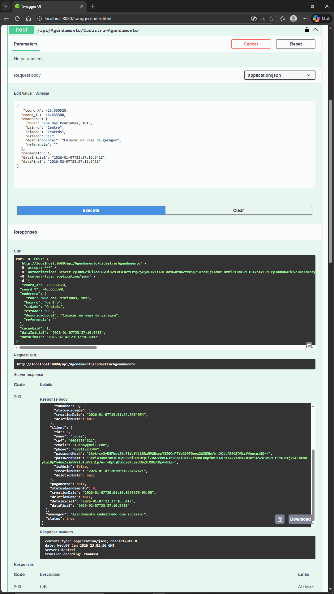
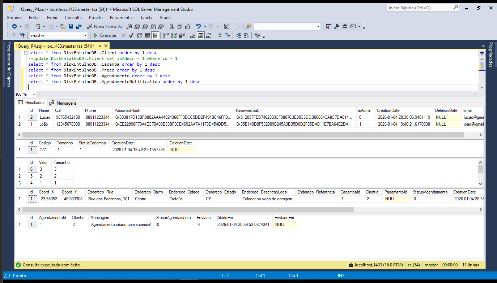
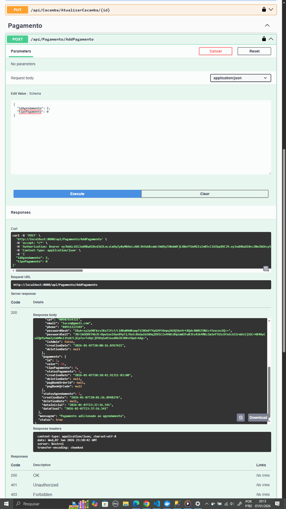
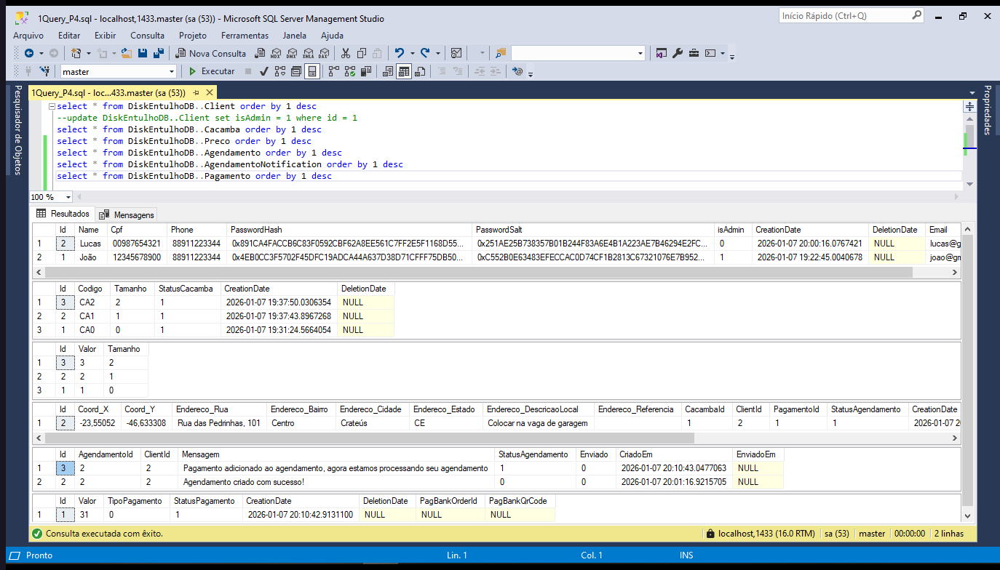
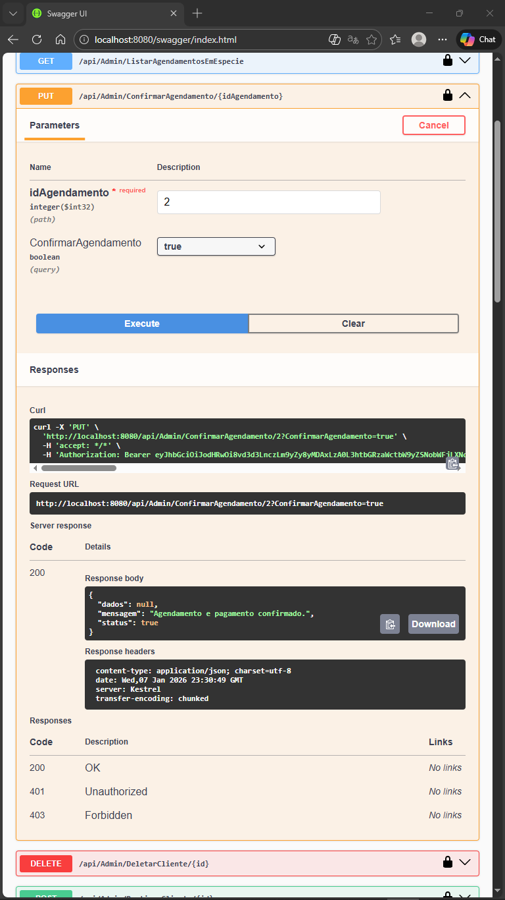
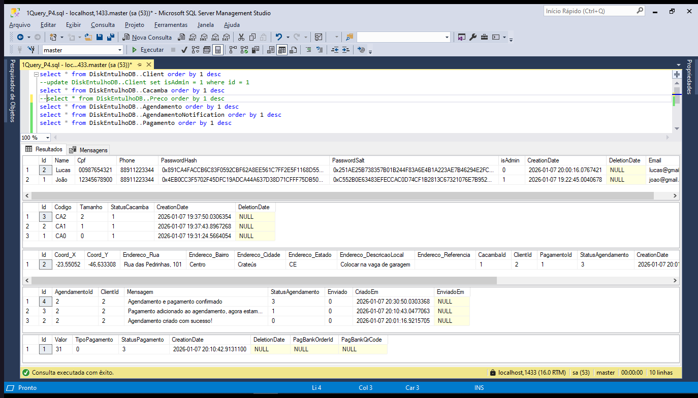

# 🚛 DiskEntulho - Sistema de Gerenciamento de Caçambas

Sistema completo para locação e gerenciamento de caçambas de entulho, com painel administrativo e integração de pagamentos.


## 🚀 Tecnologias Utilizadas

- **Backend:** .NET 9 (C#), Entity Framework Core
- **Frontend:** React (Next.js), Tailwind CSS
- **Banco de Dados:** SQL Server (via Docker)
- **Infraestrutura:** Docker & Docker Compose
- **Pagamentos:** Integração com PagBank (PIX e Cartão)

## ⚙️ Pré-requisitos

- Docker e Docker Compose instalados.
- Git instalado.
- Arquivo .env

## 🛠️ Como Rodar o Projeto

O projeto está totalmente containerizado. Para rodar, basta executar:

1. Clone o repositório:
   ```bash
   git clone [https://github.com/seu-usuario/DiskEntulho_PI4.git](https://github.com/seu-usuario/DiskEntulho_PI4.git)
   cd DiskEntulho_PI4 
   ```

2. Suba os containers (Frontend, API e Banco):

   ```bash
   docker compose up -d --build
   ```

   2.1. Acesse a aplicação:

   - Frontend: http://localhost:3000
   - Swagger (API): http://localhost:5036/swagger (ou a porta configurada no docker-compose)

3. Ou suba só o container do Banco: (Alternativo)
   ```bash
   docker compose up -d sqlserver
   ```
   3.1 Acesse a pasta da API:
   ```bash
   cd backend
   ```
   3.2 Atualize as migrations:
   ```bash
   dotnet ef database update
   ```
   3.3 E inicialize a api pelo código:
   ```bash
   dotnet run
   ```
   3.4 Acesse a aplicação:
   - Swagger (API): http://localhost:8080/swagger

## 📂 Estrutura do Projeto

O projeto está organizado em dois diretórios principais, separando as responsabilidades de interface e regra de negócio:

```plaintext
DiskEntulho_PI4/
├── 📂 backend/             # API em .NET 9
│   ├── 📂 Controllers/     # Endpoints da API (Admin, Auth, Cacamba, etc.)
│   ├── 📂 DTO/             # Objetos de Transferência de Dados
│   ├── 📂 Models/          # Entidades do Banco de Dados (Entity Framework)
│   ├── 📂 Services/        # Regras de Negócio
│   └── 📄 Dockerfile       # Configuração da imagem do Backend
│
├── 📂 frontend/            # Aplicação Web em Next.js (React)
│   ├── 📂 src/
│   │   ├── 📂 app/         # Páginas e Rotas (Next.js App Router)
│   │   ├── 📂 components/  # Componentes reutilizáveis (UI)
│   │   └── 📂 services/    # Integração com a API (Axios/Fetch)
│   └── 📄 Dockerfile       # Configuração da imagem do Frontend
│
├── 📄 docker-compose.yml   # Orquestração dos containers (App, API, Banco)
└── 📄 README.md            # Documentação do Projeto
```

## 🔐 Autenticação e Segurança

A segurança do sistema é gerenciada via **JWT (JSON Web Token)**. O controle de acesso é baseado em *Roles* (perfis), garantindo que apenas usuários autorizados acessem endpoints sensíveis.

### 👤 Perfis de Acesso (Roles)

- **Cliente:** Pode agendar caçambas, visualizar seu próprio histórico e realizar pagamentos (PIX/Cartão).
- **Admin:** Possui privilégios elevados para:
  - Aprovar pagamentos em espécie.
  - Gerenciar cadastro de caçambas e preços.
  - Visualizar todos os agendamentos do sistema.

### ⚙ Como Funciona

1. **Login:** O usuário envia o CPF e Senha para o endpoint de autenticação.
2. **Token:** O backend valida e retorna um token JWT (Bearer Token).
3. **Requisições:** O Frontend armazena esse token e o envia no cabeçalho `Authorization` de cada requisição HTTP subsequente.

### 🛣 Acessando Rotas Protegidas (Swagger)

Para testar endpoints com cadeado 🔒 no Swagger:

**Exemplo de JSON (Body):**

```json
{
  "name": "João",
  "cpf": "12345678900",
  "email": "joao@gmail.com",
  "phone": "88911223344",
  "password": "123"
}
```

1. Faça registro na rota `/api/Auth/Register`.

2. Depois faça login na rota `/api/Auth/Login` e copie o `token` gerado.

3. Clique no botão verde **Authorize** no topo da página.
4. Insira o valor no formato: `Bearer SEU_TOKEN_COPIADO`.

5. Clique em **Authorize**. Agora você tem acesso às rotas de Cliente.

### 👑 Como Criar um Usuário Admin

Por questões de segurança, todo novo usuário cadastrado via API ou Frontend nasce com o perfil **Cliente** (`isAdmin = 0`). Para elevar o nível de acesso para **Admin**, é necessário acesso direto ao Banco de Dados.

1. **Crie o usuário** normalmente pela rota `/api/Auth/Register`.
2. **Conecte-se ao SQL Server** (via SSMS, Azure Data Studio ou DBeaver).
   - **Server:** `localhost,1433`
   - **User:** `sa`
   - **Password:** `1234` (Conforme configurado no Docker)
     

3. **Execute o comando SQL** para alterar a permissão:
   ```sql
   -- Substitua 'seu@email.com' pelo email do usuário cadastrado
   UPDATE DiskEntulhoDB..Client SET isAdmin = 1 WHERE Email = 'seu@email.com';
   ```   
   

4. **Gere um novo Token:** Após a alteração, faça login novamente para gerar um token atualizado com as permissões de Admin.

## 🗑️ Gerenciamento de Caçambas

Módulo responsável pelo inventário das caçambas. O sistema diferencia operações de consulta (disponíveis para Clientes) e operações de gestão (exclusivas para Admins).

### 🔍 Verificar Disponibilidade (Inteligente)

O sistema possui uma lógica que cruza as datas solicitadas com os agendamentos existentes para retornar apenas caçambas livres.

- **Rota:** `GET /api/Cacamba/CacambasDisponiveis?inicio=AAAA-MM-DD&fim=AAAA-MM-DD`
- **Permissão:** Cliente ou Admin
- **Lógica:**
  - O sistema verifica agendamentos com status *Criado*, *Processando* ou *Confirmado*.
  - Retorna apenas caçambas que **não** conflitam com o intervalo de datas informado.
  - Valida se a `dataInicial` é menor que a `dataFinal`.

### 🛠️ Gestão de Inventário (Exclusivo Admin)

Apenas usuários com perfil **Admin** podem cadastrar, editar ou remover caçambas do sistema.

- **Cadastrar:** `POST /api/Cacamba/CadastrarCacamba`
- **Listar:** `GET /api/Cacamba/ListarTodasCacambas`
- **Atualizar:** `PUT /api/Cacamba/AtualizarCacamba/{id}`
- **Remover:** `DELETE /api/Cacamba/{id}` (Soft Delete - Apenas marca a data de exclusão)

**Exemplo de JSON para Cadastro:**
```json
{
   "codigo": "CA1",
  "tamanho": 1
}
```
Resposta esperada:



## 💲 Gerenciamento de Preços

O sistema permite que administradores definam o valor da locação baseando-se no tamanho da caçamba. Esta rota é protegida e valida estritamente os tamanhos permitidos pelo sistema.

### 🏷️ Cadastrar Novo Preço

Define quanto custa locar uma caçamba de determinado tamanho. O sistema impede a criação de preços duplicados para o mesmo tamanho.

- **Rota:** `POST /api/Admin/CadastrarPreco`
- **Permissão:** Exclusivo Admin (Requer Token)
- **Regra de Tamanho:** O campo `tamanho` aceita apenas os números correspondentes ao Enum do sistema:
  - `0` = Pequeno
  - `1` = Médio
  - `2` = Grande

**Exemplo de JSON (Body):**
```json
{
  "valor": 250.00,
  "tamanho": 1
}
```
Resposta esperada:



### 📝 Criar um Agendamento

- **Pré Requisitos:** Para que seja possivel o agendamento é preciso que as Caçambas e os Preços já tenham sido cadastrados.
- **Rota:** `POST /api/Agendamento/CadastrarAgendamento`
- **Permissão:** Cliente ou Admin (Requer Token Bearer)
- **Regras:**
  - `DataInicial` e `DataFinal` devem ser datas futuras.
  - `DataInicial` deve ser anterior à `DataFinal`.
  - O `CacambaId` deve ser de uma caçamba existente no banco.

**Exemplo de JSON (Body):**
```json
{
   "coord_X": -23.550520,
  "coord_Y": -46.633308,
  "endereco": {
     "rua": "Rua das Pedrinhas, 101",
    "bairro": "Centro",
    "cidade": "Crateús",
    "estado": "CE",
    "descricaoLocal": "Colocar na vaga de garagem",
    "referencia": ""
  },
  "cacambaId": 1,
  "dataInicial": "2026-01-04T23:37:16.541Z",
  "dataFinal": "2026-02-04T23:37:16.541Z"
}
```
Resposta esperada:



## 💳 Sistema de Pagamentos

O projeto possui integração direta com a **API do PagBank (Sandbox)** para processamento de pagamentos digitais, além de suportar pagamentos manuais.

### 💠 Métodos Suportados

#### 1. PIX (Integrado)
- **Fluxo:** Ao finalizar o agendamento, o backend se comunica com o PagBank.
- **Retorno:** É gerado um **QR Code** (Copia e Cola) dinâmico, salvo no banco na coluna `PagBankQrCode`.
- **Status:** O sistema aguarda a confirmação do pagamento (Webhooks ou verificação futura).

#### 2. Em Espécie (Manual)
- **Fluxo:** O cliente escolhe pagar na entrega/retirada.
- **Status Inicial:** O agendamento fica travado como `Processando`.
- **Aprovação:** É necessário que um **Admin** libere manualmente através do sistema.

### 👮‍♂️ Área do Admin (Financeiro)

Para pagamentos em espécie, o administrador deve confirmar o recebimento para liberar o agendamento.

- **Endpoint de Aprovação:** `PUT /api/Pagamento/AprovarPagamentoEspecie/{id}`
- **Permissão:** Exclusivo Admin.
- **Lógica:**
  1. Busca o agendamento pelo ID.
  2. Verifica se o tipo de pagamento é realmente "Espécie".
  3. Altera o status do pagamento para `Aprovado`.
  4. Altera o status do agendamento para `Confirmado`.

### ⚙️ Configuração (Environment)
Para que a integração funcione, o arquivo `.env` deve conter as credenciais do PagBank Sandbox:

```env
PAGBANK_TOKEN=seu_token_de_sandbox
PAGBANK_URL=[https://sandbox.api.pagseguro.com](https://sandbox.api.pagseguro.com) 
```

## 💸 Fluxo de Pagamento e Aprovação

O sistema implementa um fluxo de pagamento em duas etapas para modalidades que exigem verificação manual (como Pagamento em Espécie - Tipo 0).

### Passo 1: Solicitação de Pagamento (Cliente)
O cliente informa como deseja pagar. Neste momento, o sistema calcula o valor final, vincula o pagamento ao agendamento e coloca o pedido em análise.

- **Rota:** `POST /api/Pagamento/AddPagamento`
- **Permissão:** Cliente
- **Comportamento:**
  - O `StatusAgendamento` muda para **1 (Processando)**.
  - O `StatusPagamento` é criado como **1 (Pendente)**.
  - Uma notificação é gerada: *"Pagamento adicionado... agora estamos processando seu agendamento"*.

**Payload Exemplo:**
```json
{
  "idAgendamento": 2,
  "tipoPagamento": 0  // 0 = Espécie
}
```



### Passo 2: Confirmação Financeira (Admin)
Após receber o valor ou confirmar a transação, o Administrador deve liberar o agendamento manualmente.

- **Rota:** `PUT /api/Admin/ConfirmarAgendamento/{idAgendamento}?ConfirmarAgendamento=true`
- **Permissão:** Admin
- **Comportamento:**
  - O `StatusAgendamento` muda para 3 (Confirmado).

  - O `StatusPagamento` muda para 3 (Aprovado).

  - O cliente recebe a notificação final: "Agendamento e pagamento confirmado".
    
  
  

Nota Técnica: O endpoint de confirmação está centralizado no AdminController, garantindo que apenas usuários com a role Admin possam validar transações financeiras manuais.