# 🚛 DiskEntulho - Sistema de Gerenciamento de Caçambas


Sistema completo para locação e gerenciamento de caçambas de entulho, com painel administrativo e integração de pagamentos.

<div align="center">
  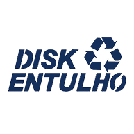
  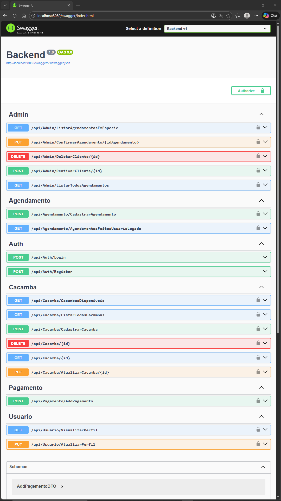
</div>

## 🚀 Tecnologias Utilizadas

- **Backend:** .NET 9 (C#), Entity Framework Core
- **Frontend:** React (Next.js), Tailwind CSS
- **Banco de Dados:** SQL Server (via Docker)
- **Infraestrutura:** Docker & Docker Compose
- **Pagamentos:** Integração com PagBank (Sandbox)

## ⚙️ Pré-requisitos

- Docker e Docker Compose instalados.
- Git instalado.
- Arquivo .env

## ⚙️ Configuração (Environment)
Para que a integração funcione, o arquivo `.env` deve conter as credenciais do PagBank Sandbox:

```env
PAGBANK_TOKEN=seu_token_de_sandbox
PAGBANK_URL=[https://sandbox.api.pagseguro.com](https://sandbox.api.pagseguro.com) 
```

## 🛠️ Como Rodar o Projeto

O projeto está totalmente containerizado. Para rodar, basta executar:

1. Clone o repositório:
   ```bash
   git clone [https://github.com/seu-usuario/DiskEntulho_PI4.git](https://github.com/seu-usuario/DiskEntulho_PI4.git)
   cd DiskEntulho_PI4 
   ```

2. Suba os containers (Frontend e Banco):

   ```bash
   docker compose up -d --build
   ```

3. Inicialize a API:
   3.1 Acesse a pasta da API:
   ```bash
   cd backend
   ```
   3.2 Atualize as migrations:
   ```bash
   dotnet ef database update
   ```
   3.3 E inicialize a api pelo código:
   ```bash
   dotnet run
   ```
   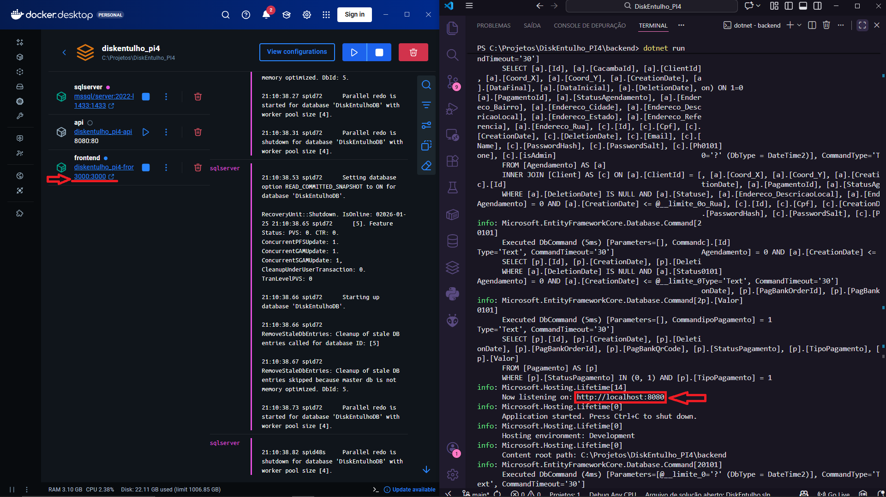

   3.4 Acesse as aplicações:
   - Frontend: http://localhost:3000/auth/login
   - Swagger (API): http://localhost:8080/swagger
   
   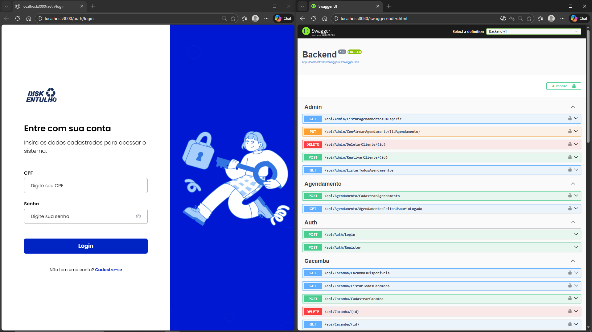

## 📂 Estrutura do Projeto

O projeto está organizado em dois diretórios principais, separando as responsabilidades de interface e regra de negócio:

```plaintext
DiskEntulho_PI4/
├── 📂 backend/             # API em .NET 9
│   ├── 📂 Controllers/     # Endpoints da API (Admin, Auth, Cacamba, etc.)
│   ├── 📂 DTO/             # Objetos de Transferência de Dados
│   ├── 📂 Models/          # Entidades do Banco de Dados (Entity Framework)
│   ├── 📂 Services/        # Regras de Negócio
│   └── 📄 Dockerfile       # Configuração da imagem do Backend
│
├── 📂 frontend/            # Aplicação Web em Next.js (React)
│   ├── 📂 src/
│   │   ├── 📂 app/         # Páginas e Rotas (Next.js App Router)
│   │   ├── 📂 components/  # Componentes reutilizáveis (UI)
│   │   └── 📂 services/    # Integração com a API (Axios/Fetch)
│   └── 📄 Dockerfile       # Configuração da imagem do Frontend
│
├── 📄 docker-compose.yml   # Orquestração dos containers (App, API, Banco)
└── 📄 README.md            # Documentação do Projeto
```

## 📸 Visão Geral do Sistema

### 🔐 Autenticação e Segurança
O sistema possui controle de acesso seguro via JWT. Novos usuários criam conta como **Clientes**, enquanto o acesso **Admin** gerencia o negócio.

| Cadastro | Login |
|:---:|:---:|
| 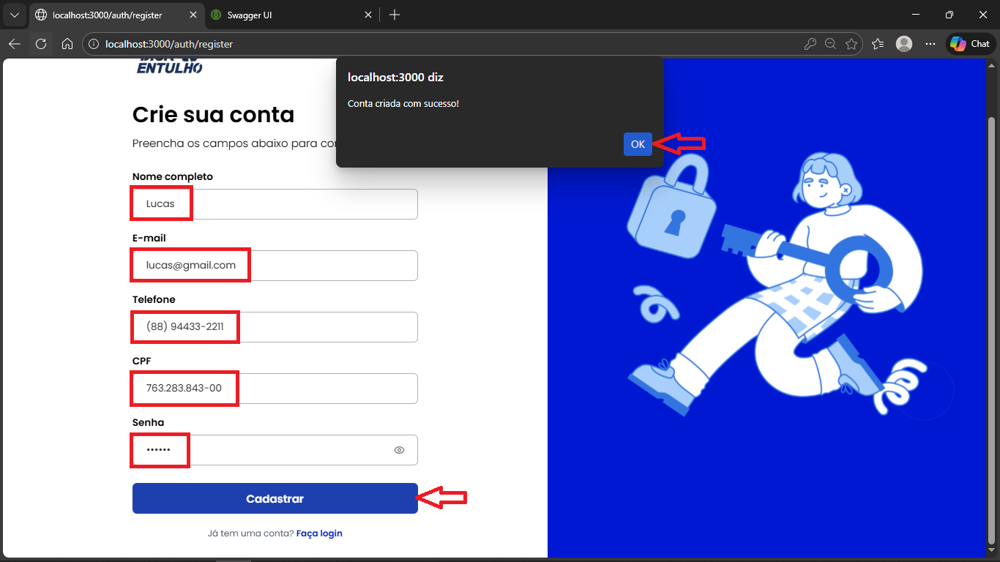 | 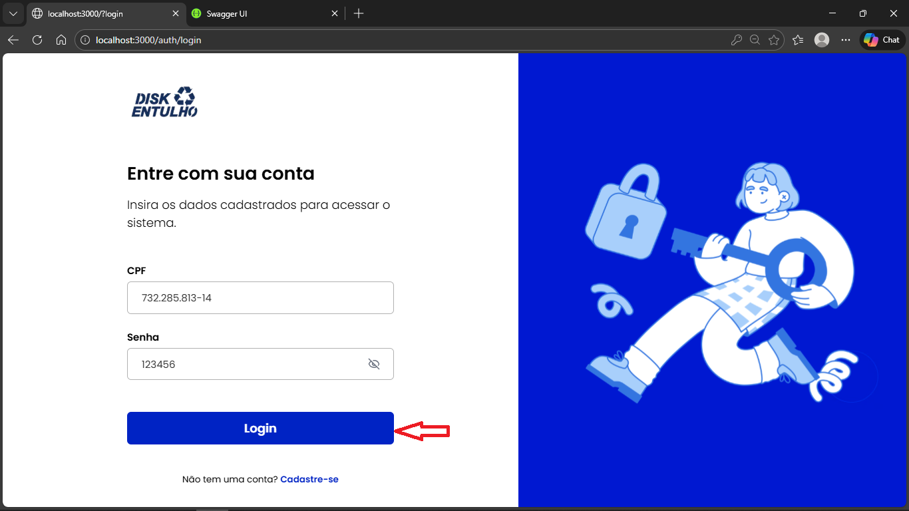 |

### 👮‍♂️ Área do Administrador
Painel de gestão para controle total da operação.

**Dashboard e Gestão**
Controle de agendamentos, aprovação de pagamentos manuais e gestão de inventário.
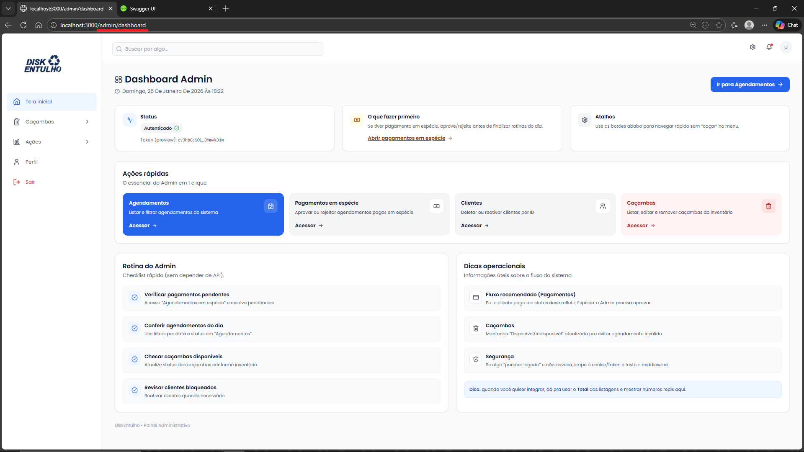

**Cadastro de Inventário**
Adição de novas caçambas e definição de preços por tamanho.
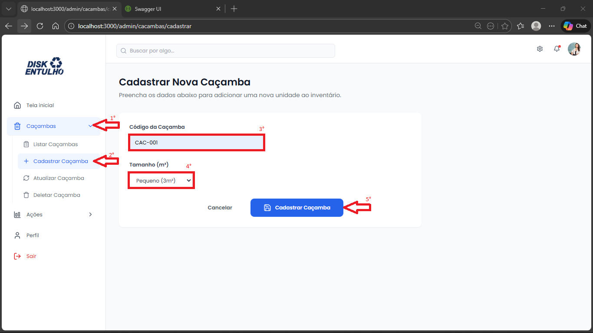

**Aprovar pagamentos em espécie**
Visualização de todos os pedidos pendentes, podendo **Confirmar** ou **Rejeitar** a locação.
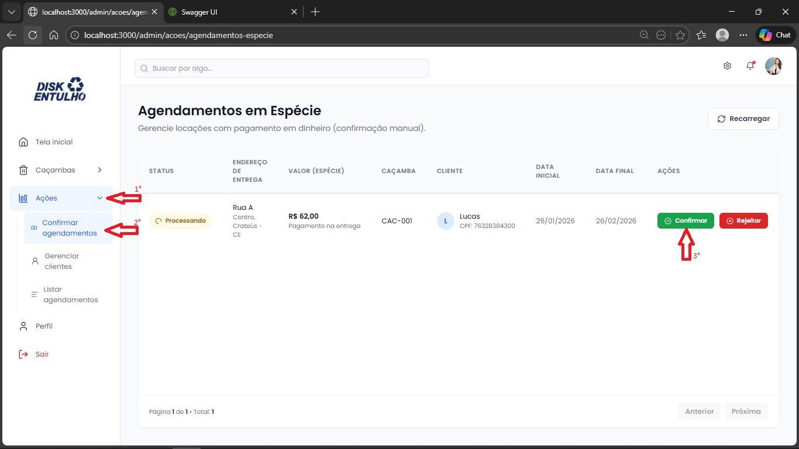

---

### 👤 Área do Cliente
O cliente tem um painel intuitivo para solicitar caçambas, ver histórico e realizar pagamentos.

**1. Painel Principal**
Visão geral de agendamentos e status da sessão.
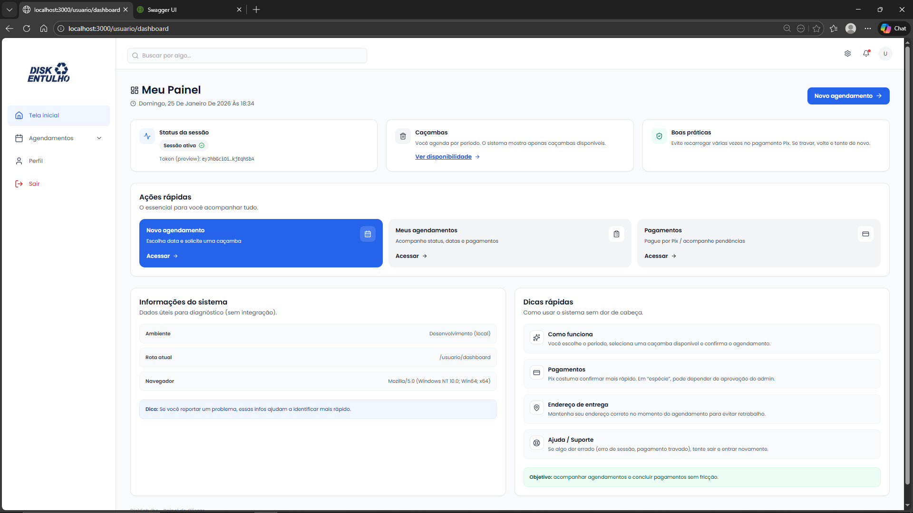

**2. Fluxo de Agendamento Inteligente**
O cliente seleciona as datas e o sistema retorna **apenas caçambas disponíveis** no inventário para aquele período, evitando conflitos.
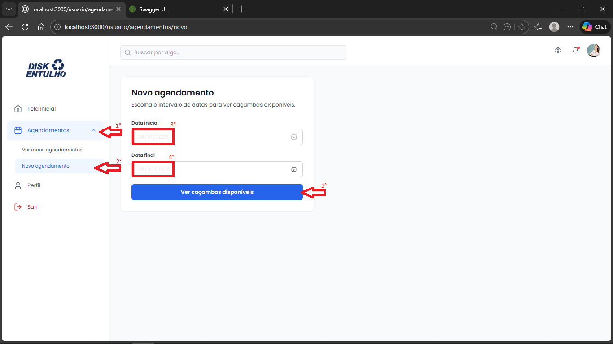
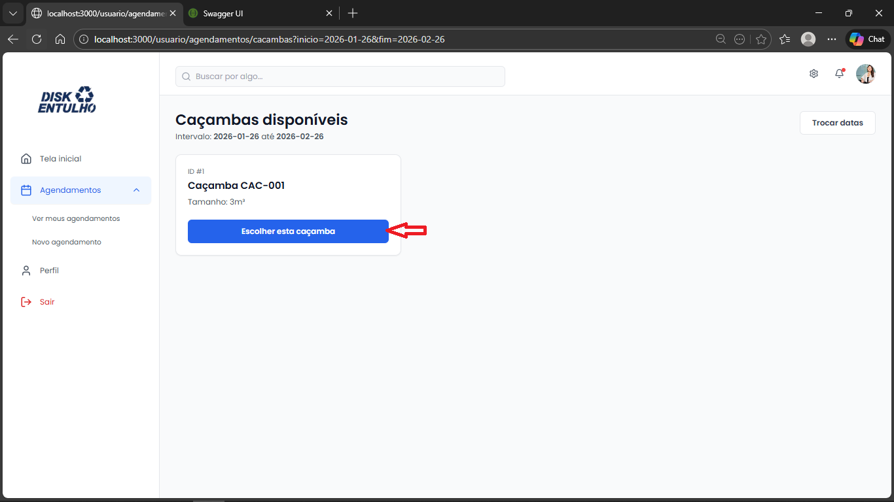

**3. Endereço e Pagamento**
Cadastro do local de entrega e escolha da forma de pagamento (PIX Integrado ou Espécie).
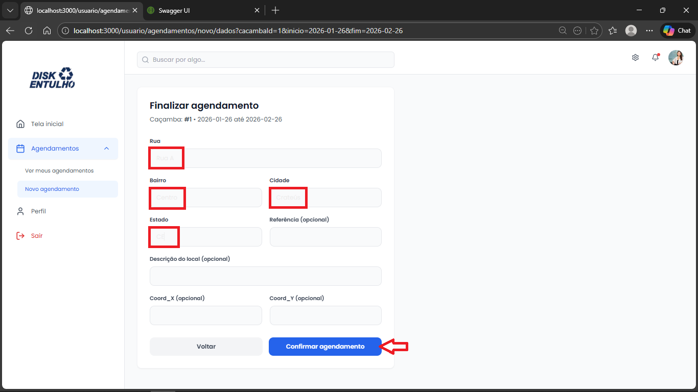


## 🛣 Acessando Rotas do Sistema e Autenticação

O acesso ao sistema é protegido por autenticação JWT. O fluxo de entrada foi desenhado para ser intuitivo, com redirecionamento automático baseado no perfil do usuário (Cliente ou Admin).

### 1. Criar Conta (Cadastro)
Novos usuários devem se registrar fornecendo dados pessoais. O sistema realiza validações de formato (CPF, Email) antes de enviar ao backend.

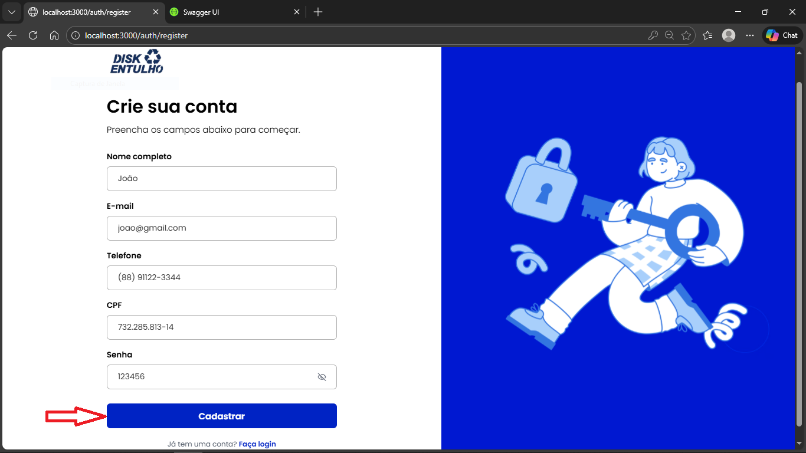
*Ao clicar em cadastrar, o usuário recebe feedback visual imediato:*
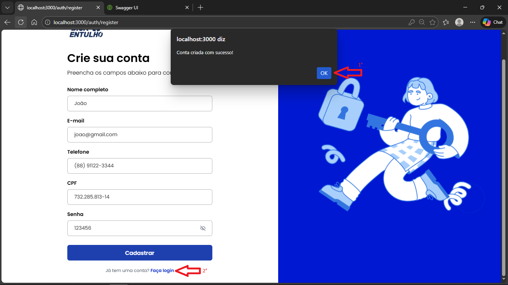

### 2. Login
Para acessar, o usuário utiliza o **CPF** e a **Senha** cadastrados. O frontend gerencia o token de sessão de forma transparente.


### 3. Regra de Permissão Automática (Admin)
O sistema verifica automaticamente se o banco de dados está vazio.
1. O **primeiro usuário** a se cadastrar no sistema receberá automaticamente permissões de **Administrador** (`isAdmin = 1`).
2. Todos os usuários cadastrados **posteriormente** serão criados com o perfil padrão de **Cliente** (`isAdmin = 0`).

> **Evidência no Banco de Dados:** Observe na imagem abaixo que a coluna `isAdmin` foi definida automaticamente como `1` (True) para o primeiro usuário, sem necessidade de intervenção manual.

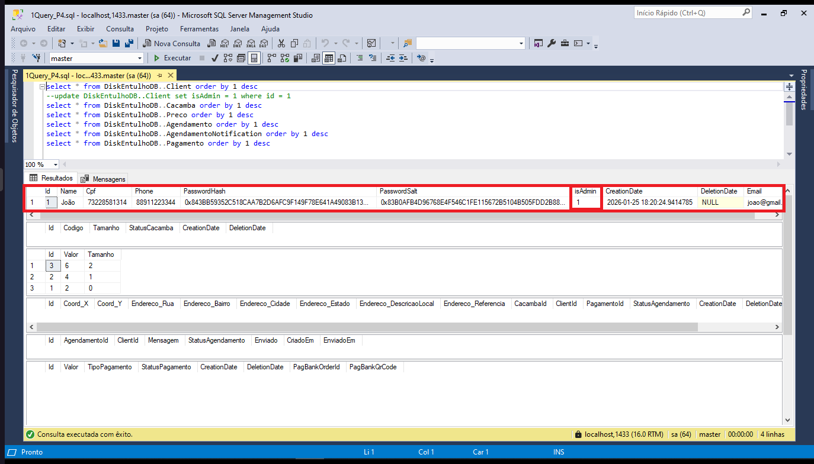

### 4. Acesso ao Painel
Ao detectar que o usuário logado possui a claim de **Admin**, o sistema o redireciona para o **Dashboard Administrativo**, liberando as funcionalidades de gestão.


### 🔧 Promover Outros Usuários (Opcional)

Caso você precise transformar um **Cliente** comum em **Admin** posteriormente, será necessário acesso direto ao banco de dados:

1. **Conecte-se ao SQL Server** (via SSMS, Azure Data Studio ou DBeaver).
   - **Server:** `localhost,1433`
   - **User:** `sa`
   - **Password:** `1234` (Conforme configurado no Docker)
     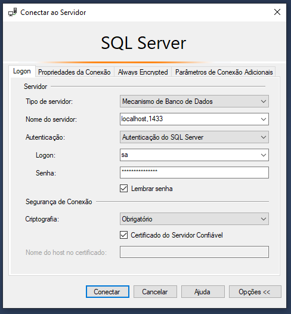

2. **Execute o comando SQL** para alterar a permissão:
   ```sql
   -- Substitua 'seu@email.com' pelo email do usuário cadastrado
   UPDATE DiskEntulhoDB..Client SET isAdmin = 1 WHERE Email = 'seu@email.com';
   ```   
   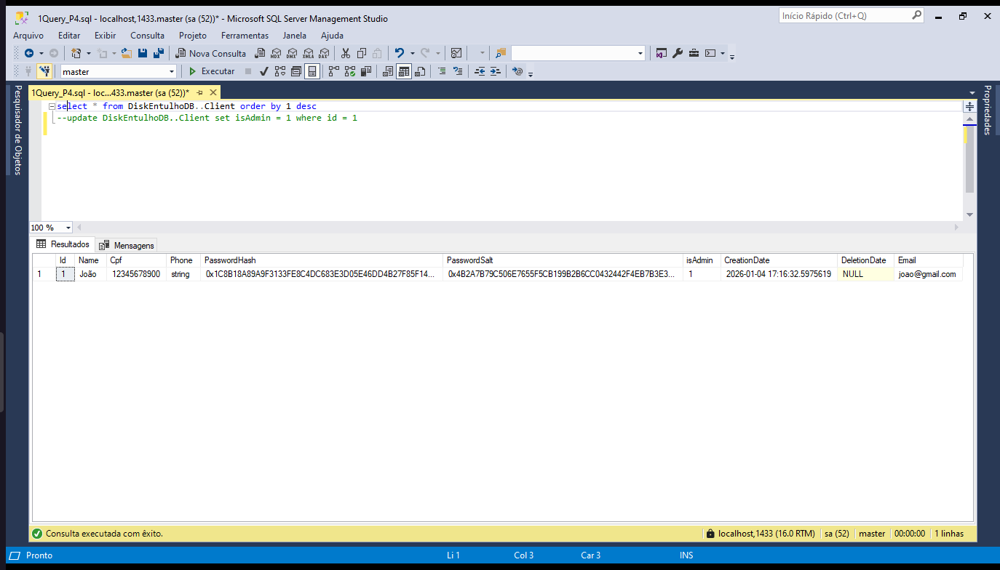

## 🗑️ Gerenciamento de Caçambas

O sistema possui um controle de inventário robusto. Enquanto clientes apenas visualizam caçambas disponíveis para datas específicas, o **Administrador** possui acesso total para cadastrar e gerenciar o estoque físico.

### ➕ Cadastro de Nova Caçamba

O fluxo de cadastro foi desenhado para ser simples e direto, validando os dados antes do envio para a API.

1. **Acesso:** No menu lateral, o Admin acessa **Caçambas > Cadastrar Caçamba**.
2. **Preenchimento:**
   - **Código:** Identificador único da caçamba (ex: `CAC-001`).
   - **Tamanho:** Seleção via dropdown (Pequeno, Médio ou Grande).
3. **Feedback:** Ao clicar em "Cadastrar", o sistema envia os dados e retorna um modal de sucesso imediato.


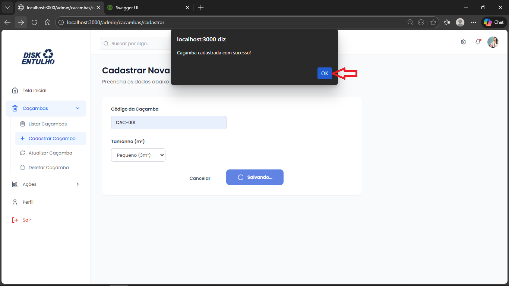

### 💾 Persistência de Dados (Banco de Dados)

Após o cadastro no Frontend, os dados são persistidos instantaneamente no SQL Server.
> **Nota Técnica:** O tamanho "Pequeno" selecionado na interface é convertido automaticamente para o Enum `0` no banco de dados, mantendo a integridade da regra de negócio.

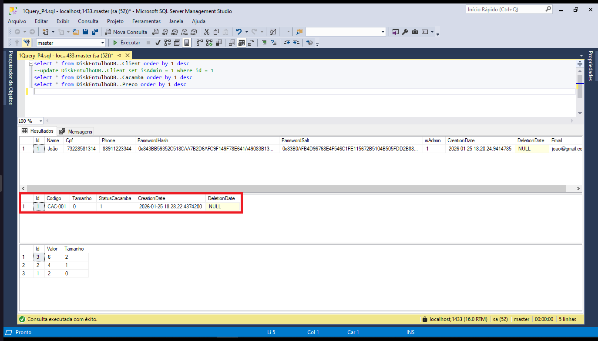

### 🔌 Endpoints Relacionados (API)

A gestão é realizada através do `CacambaController`, protegido pela role de Admin.

- **Cadastrar:** `POST /api/Cacamba/CadastrarCacamba`
- **Listar:** `GET /api/Cacamba/ListarTodasCacambas`
- **Atualizar:** `PUT /api/Cacamba/AtualizarCacamba/{id}`
- **Remover:** `DELETE /api/Cacamba/{id}` (Soft Delete - Apenas marca a data de exclusão)

## 📝 Criar um Agendamento

O sistema oferece uma experiência fluida para o cliente, guiando-o desde a escolha da data até o pagamento, com validações em tempo real.

### 1. Verificação de Disponibilidade
O cliente seleciona o período de locação desejado. O backend processa as datas e retorna **apenas** as caçambas do inventário que não possuem conflito de agenda para aquele intervalo.


### 2. Endereço de Entrega
O usuário informa o local exato para a entrega da caçamba. Ao confirmar, o Frontend envia os dados para a API (`POST /api/Agendamento`), que valida as informações e cria o registro inicial.


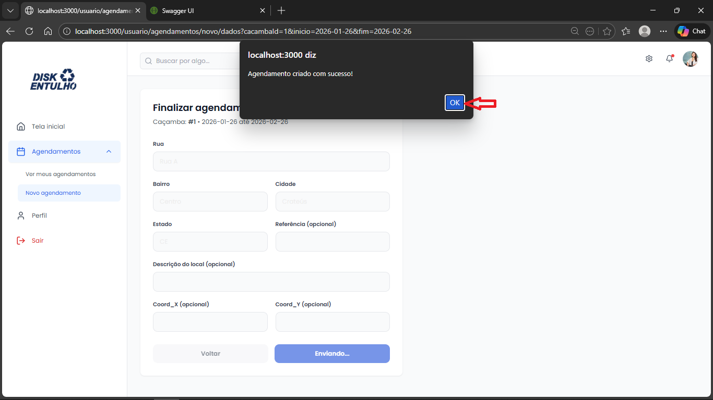

### 3. Definição de Pagamento
Imediatamente após o agendamento, o cliente define como deseja pagar.
- **Espécie:** O status permanece "Processando" aguardando liberação do Admin.
- **PIX/Cartão:** Integração automática via PagBank.


### 4. Acompanhamento e Persistência
O cliente é redirecionado para "Meus Agendamentos", onde vê o status atualizado em tempo real. Nos bastidores, garantimos a integridade relacional dos dados no SQL Server.

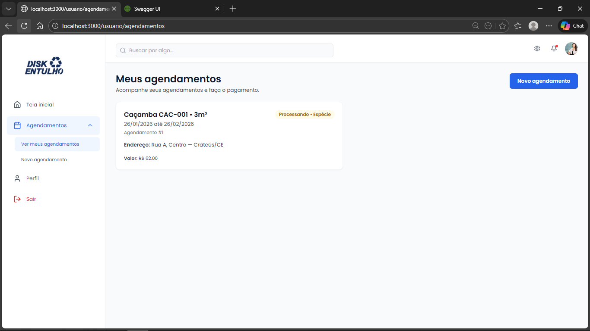
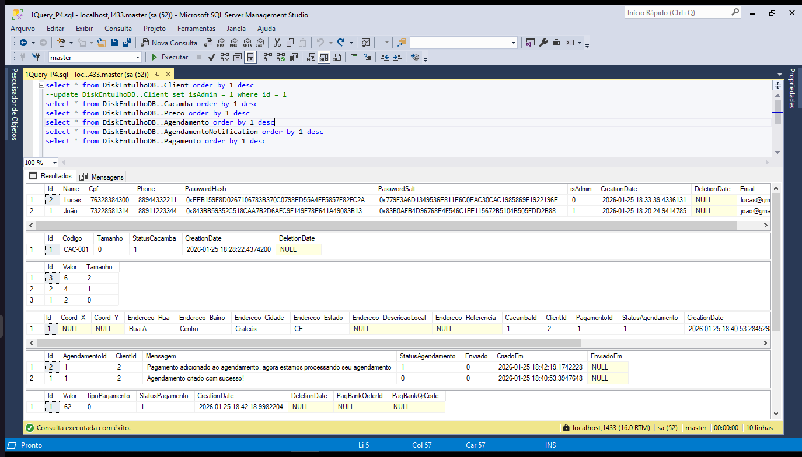

## 💳 Sistema de Pagamentos

O projeto possui integração direta com a **API do PagBank (Sandbox)** para processamento de pagamentos digitais, além de suportar pagamentos manuais.

> **📝 Nota Técnica (Enum):**
> No banco de dados, o campo `TipoPagamento` segue o seguinte mapeamento:
> - **`0` = Espécie:** Pagamento manual (Dinheiro), requer aprovação do Admin.
> - **`1` = PIX:** Pagamento digital, integrado e aprovado automaticamente.

### 💠 Métodos Suportados:

### 1. 💸 Fluxo de Pagamento e Aprovação (Espécie)

O sistema implementa um fluxo de segurança financeira. Pagamentos em espécie (dinheiro) não são aprovados automaticamente; eles entram em um estado de "Processando" até que um Administrador confirme o recebimento.

#### Passo 1: Solicitação de Pagamento 
Ao finalizar o agendamento escolhendo "Espécie", o sistema registra o pedido com **Status 1 (Processando)**. O cliente é notificado que o pedido está sob análise.


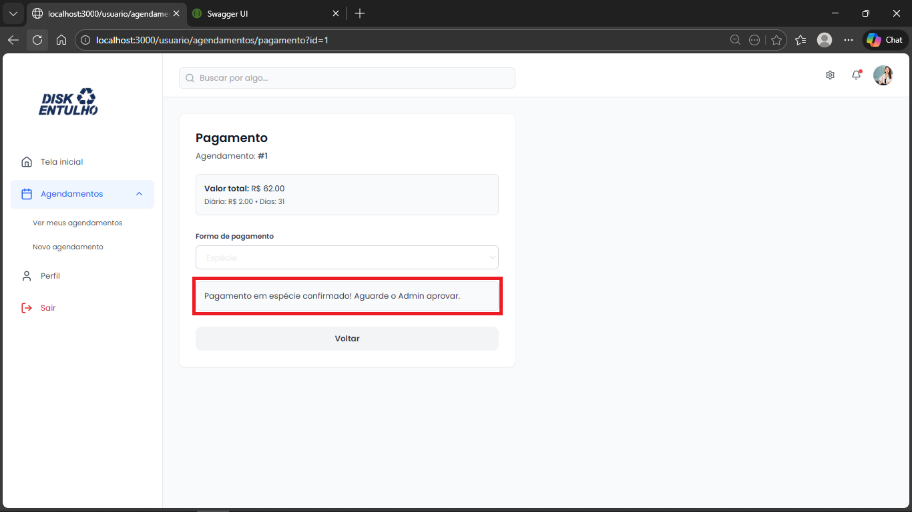

> **No Banco de Dados:** O registro é criado, mas os StatusPagamento e StatusAgendamento ficam como `1` (Pendente/Processando).


#### Passo 2: Aprovação do Administrador
O Admin acessa o menu **Ações > Confirmar Agendamentos**. Nesta tela exclusiva, ele visualiza todos os pedidos pendentes e pode **Confirmar** ou **Rejeitar** a locação.


#### Passo 3: Confirmação e Atualização de Status
Ao clicar em "Confirmar", o Frontend se comunica com a API, que executa a validação e retorna o feedback de sucesso.

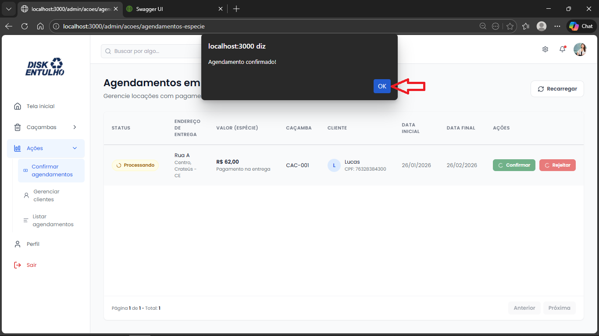

#### Passo 4: Resultado Final (Persistência)
Instantaneamente, o backend atualiza os registros no SQL Server:
- **StatusPagamento:** Muda para `3` (Aprovado).
- **StatusAgendamento:** Muda para `3` (Confirmado).
- **Notificação:** O sistema gera automaticamente um aviso para o cliente: *"Agendamento e pagamento confirmado"*.

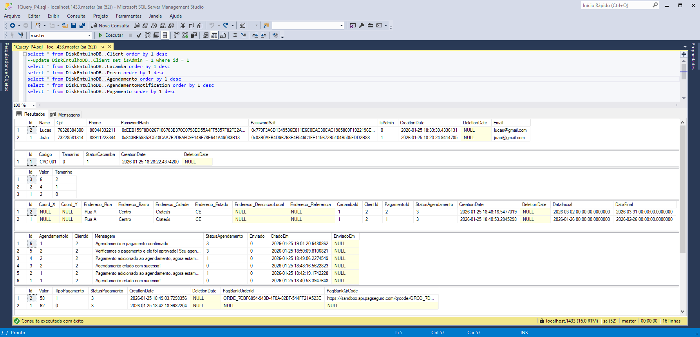

### 2. 💠 Fluxo de Pagamento via PIX (Automático)

Diferente do pagamento em espécie, o fluxo via PIX é totalmente integrado. O sistema se comunica diretamente com a API do PagBank para gerar cobranças dinâmicas e processar a aprovação sem intervenção humana.

#### 1. Seleção do Método
No checkout, o cliente seleciona a opção **Pix**. O sistema calcula o valor total e prepara a requisição segura para o gateway de pagamento.

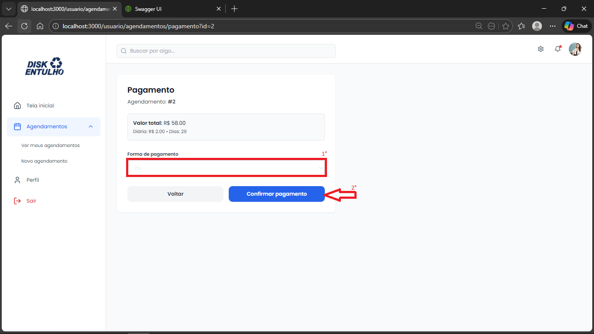

#### 2. Geração do QR Code
O backend envia os dados para o PagBank, que retorna um **QR Code** (Link). O sistema exibe o link "Abrir" para o usuário realizar o pagamento instantâneo.

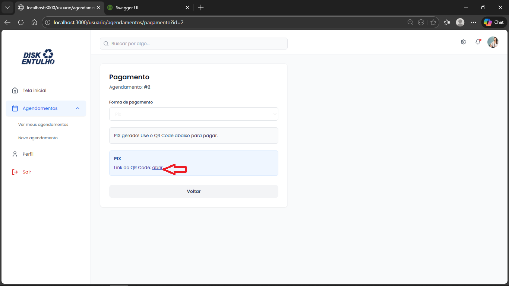

#### 3. Processamento e Persistência
Após a confirmação (Simulada no Sandbox), o sistema atualiza os registros automaticamente no SQL Server:
- **StatusPagamento:** Atualiza para `3` (Aprovado).
- **StatusAgendamento:** Atualiza para `3` (Confirmado).
- **Auditoria:** Os campos `PagBankOrderId` e `PagBankQrCode` são salvos para rastreio.
- **Notificação:** O sistema envia um aviso automático: *"Verificamos o pagamento e ele foi aprovado!"*.

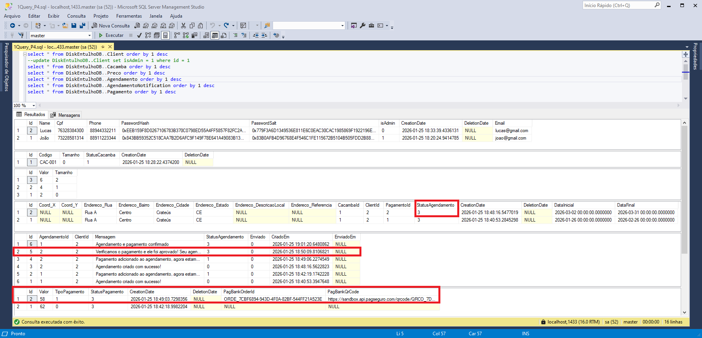