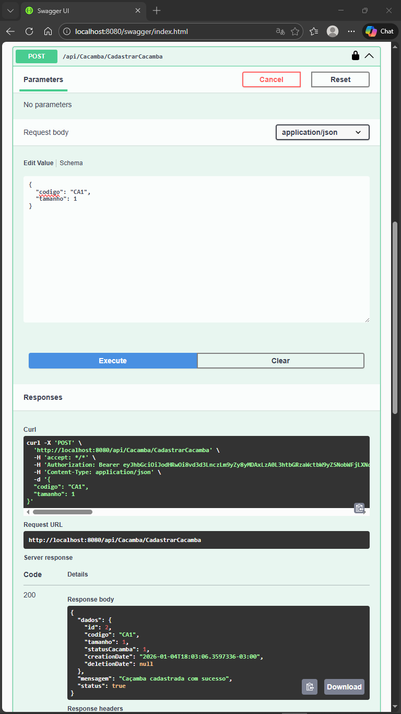
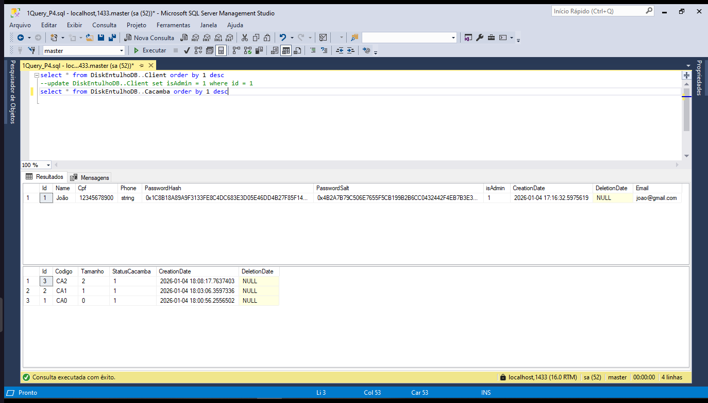

   | docker run -e "ACCEPT_EULA=Y" -e "SA_PASSWORD=1234" -p 1433:1433 --name sqlserver2022 -d mcr.microsoft.com/mssql/server:2022-latest 

# 🚛 DiskEntulho - Sistema de Gerenciamento de Caçambas

Sistema completo para locação e gerenciamento de caçambas de entulho, com painel administrativo e integração de pagamentos.


## 🚀 Tecnologias Utilizadas

- **Backend:** .NET 8 (C#), Entity Framework Core
- **Frontend:** React (Next.js), Tailwind CSS
- **Banco de Dados:** SQL Server (via Docker)
- **Infraestrutura:** Docker & Docker Compose
- **Pagamentos:** Integração com PagBank (PIX e Cartão)

## ⚙️ Pré-requisitos

- Docker e Docker Compose instalados.
- Git instalado.

## 🛠️ Como Rodar o Projeto

O projeto está totalmente containerizado. Para rodar, basta executar:

1. Clone o repositório:
   ```bash
   git clone [https://github.com/seu-usuario/DiskEntulho_PI4.git](https://github.com/seu-usuario/DiskEntulho_PI4.git)
   cd DiskEntulho_PI4 
   ```

2. Suba os containers (Frontend, API e Banco):

   ```bash
   docker compose up -d --build
   ```

3. Acesse a aplicação:
   - Frontend: http://localhost:3000
   - Swagger (API): http://localhost:5036/swagger (ou a porta configurada no docker-compose)

## 🔐 Autenticação e Segurança

A segurança do sistema é gerenciada via **JWT (JSON Web Token)**. O controle de acesso é baseado em *Roles* (perfis), garantindo que apenas usuários autorizados acessem endpoints sensíveis.

### 👤 Perfis de Acesso (Roles)

- **Cliente:** Pode agendar caçambas, visualizar seu próprio histórico e realizar pagamentos (PIX/Cartão).
- **Admin:** Possui privilégios elevados para:
  - Aprovar pagamentos em espécie.
  - Gerenciar cadastro de caçambas e preços.
  - Visualizar todos os agendamentos do sistema.

### ⚙ Como Funciona

1. **Login:** O usuário envia o CPF e Senha para o endpoint de autenticação.
2. **Token:** O backend valida e retorna um token JWT (Bearer Token).
3. **Requisições:** O Frontend armazena esse token e o envia no cabeçalho `Authorization` de cada requisição HTTP subsequente.

### 🛣 Acessando Rotas Protegidas (Swagger)

Para testar endpoints com cadeado 🔒 no Swagger:
1. Faça registro na rota `/api/Auth/Register`.

2. Depois faça login na rota `/api/Auth/Login` e copie o `token` gerado.

3. Clique no botão verde **Authorize** no topo da página.
4. Insira o valor no formato: `Bearer SEU_TOKEN_COPIADO`.

5. Clique em **Authorize**. Agora você tem acesso às rotas de Cliente.

### 👑 Como Criar um Usuário Admin

Por questões de segurança, todo novo usuário cadastrado via API ou Frontend nasce com o perfil **Cliente** (`isAdmin = 0`). Para elevar o nível de acesso para **Admin**, é necessário acesso direto ao Banco de Dados.

1. **Crie o usuário** normalmente pela rota `/api/Auth/Register`.
2. **Conecte-se ao SQL Server** (via SSMS, Azure Data Studio ou DBeaver).
   - **Server:** `localhost,1433`
   - **User:** `sa`
   - **Password:** `1234` (Conforme configurado no Docker)
   


3. **Execute o comando SQL** para alterar a permissão:
   ```sql
   -- Substitua 'seu@email.com' pelo email do usuário cadastrado
   UPDATE DiskEntulhoDB..Client SET isAdmin = 1 WHERE Email = 'seu@email.com';
   ```   
   

4. **Gere um novo Token:** Após a alteração, faça login novamente para gerar um token atualizado com as permissões de Admin.

## 🗑️ Gerenciamento de Caçambas

Módulo responsável pelo inventário das caçambas. O sistema diferencia operações de consulta (disponíveis para Clientes) e operações de gestão (exclusivas para Admins).

### 🔍 Verificar Disponibilidade (Inteligente)

O sistema possui uma lógica que cruza as datas solicitadas com os agendamentos existentes para retornar apenas caçambas livres.

- **Rota:** `GET /api/Cacamba/CacambasDisponiveis?inicio=AAAA-MM-DD&fim=AAAA-MM-DD`
- **Permissão:** Cliente ou Admin
- **Lógica:**
  - O sistema verifica agendamentos com status *Criado*, *Processando* ou *Confirmado*.
  - Retorna apenas caçambas que **não** conflitam com o intervalo de datas informado.
  - Valida se a `dataInicial` é menor que a `dataFinal`.

### 🛠️ Gestão de Inventário (Exclusivo Admin)

Apenas usuários com perfil **Admin** podem cadastrar, editar ou remover caçambas do sistema.

- **Cadastrar:** `POST /api/Cacamba/CadastrarCacamba`
- **Atualizar:** `PUT /api/Cacamba/AtualizarCacamba/{id}`
- **Remover:** `DELETE /api/Cacamba/{id}` (Soft Delete - Apenas marca a data de exclusão)

**Exemplo de JSON para Cadastro:**
```json
{
   "codigo": "CA1",
  "tamanho": 1
}
```



## 📅 Agendamento de Caçambas

O sistema permite que clientes autenticados solicitem a locação de caçambas. O fluxo exige que o usuário esteja logado e informe os dados do local e período.

### 📝 Criar um Agendamento

- **Rota:** `POST /api/Agendamento/CadastrarAgendamento`
- **Permissão:** Cliente ou Admin (Requer Token Bearer)
- **Regras:**
  - `DataInicial` e `DataFinal` devem ser datas futuras.
  - `DataInicial` deve ser anterior à `DataFinal`.
  - O `CacambaId` deve ser de uma caçamba existente no banco.

**Exemplo de JSON (Body):**
```json
{
  "cacambaId": 1,
  "dataInicial": "2026-02-10T08:00:00",
  "dataFinal": "2026-02-15T18:00:00",
  "coord_X": -23.550520,
  "coord_Y": -46.633308,
  "endereco": {
    "rua": "Rua das Pedrinhas, 101",
    "bairro": "Centro",
    "cidade": "Crateús",
    "estado": "CE",
    "descricaoLocal": "Colocar na vaga de garagem",
    "referencia": ""
  }
}
```